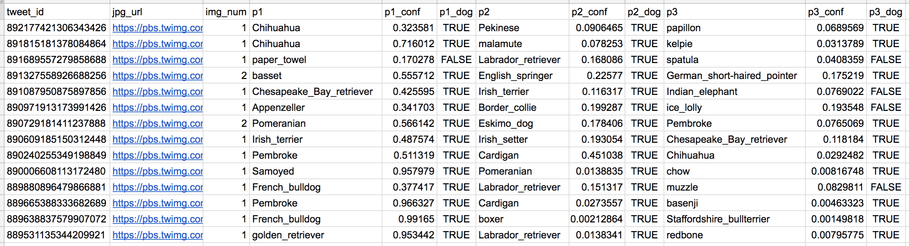

# Investigate-a-Dataset---WeRateDogs-tweets-archive
WeRateDogs dataset Wrangling and Analysis

 
<!-- Table of contents -->
## Table of contents

- [Table of contents](#table-of-contents)

- [About the project](#about-the-project)

- [Pre-requisites](#pre-requisites)
  
- [License](#license)

## About the project
The dataset I processed (and analyzed and visualized) is the archive of tweets from Twitter user @dog_rates, also known as WeRateDogs. WeRateDogs is a Twitter account that rates people's dogs with a humorous comment about the dog. These ratings almost always have a denominator of 10. But the numerators? Almost always higher than 10. 11/10, 12/10, 13/10, etc. Why? Because "they're Brent dogs". WeRateDogs has over 4 million subscribers and has received international media coverage.
The goal: to leverage Twitter data from WeRateDogs to create interesting and reliable analyses and visualizations. Twitter archives are great, but they only contain very basic information about tweets. Additional collection, evaluation and cleaning is required for meaningful analysis and visualization.
Thus in this project, I worked on the following three datasets:

+ *Enhanced Twitter archive*: It contains the note, the name of the dog and the "stages" of the dog (i.e. doggo, floofer, pupper and puppo).

+ *Additional data via the Twitter API*: Back to the basics of the Twitter archive: the number of retweets and the number of favorites are two of the notable omissions from the column. Fortunately, this additional data can be collected from the Twitter API through the WeRateDogs archive's tweet IDs.

+ *Image prediction file*: It contains the different predictions of the breeds of the dogs in the images of the tweets. 

>So, for the last row of this table:
+ p1 is the algorithm's number 1 prediction for the image in the tweet → golden retriever
+ p1_conf indicates how confident the algorithm is in its number 1 prediction → 95%
+ p1_dog indicates whether prediction number 1 is a purebred dog or not → TRUE
+ p2 is the algorithm's second most likely prediction → Labrador retriever
+ p2_conf indicates how confident the algorithm is in its prediction number 2 → 1%
+ p2_dog indicates whether prediction number 2 is a purebred dog or not → TRUE
+ etc.

## Pre-requisites

In order to run this project it is required to install python and some of its libraries:
- Python 3.7 or more
- Pandas 
- Numpy
- Matplotlib
- Tweepy
- Json
- Requests

We recommend that you install Anaconda, which comes with all the necessary packages, as well as the IPython Notebook. 

## License
Distributed under the MIT License. See [LICENSE](./LICENSE) file for more information.
